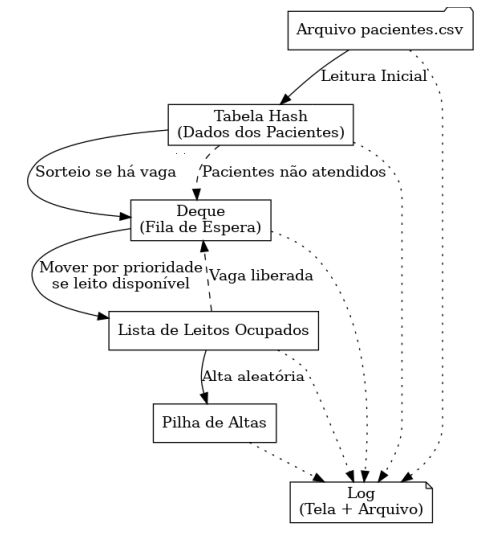

# EDB-simulacao-hospital
Projeto de faculdade

# Projeto de Simulação de Internamento Hospitalar

### Versão 1.

## 1 Descrição Geral

Este projeto simula um ambiente hospitalar com fluxo de pacientes utilizando três estruturas de dados: tabela hash, deque e pilha. O objetivo é implementar uma simulação totalmente automática, a partir de um arquivo contendo os dados dos pacientes, que são armazenados em uma tabela de dispersão. A simulação cuida da triagem, fila de espera, internamento e alta hospitalar, controlando o fluxo de entrada e saída dos pacientes.

## 2 Fluxo de Ações por Ciclo

A simulção segue a sequência lógica a cada ciclo:

1. Verificar vagas nos leitos (lista):
   - Se houver leito disponível, mover paciente do deque para a lista de leitos, priorizando aquele com maior prioridade entre as extremidades.
   - Se não houver vaga, o sistema aguarda até que pacientes recebam alta.
   - Quando ocorre alta, o paciente é removido da lista de leitos e adicionado à pilha de histórico de internamentos.

2. Verificar espaço na fila de espera (deque):
   - Se houver espaço e pacientes ainda não sorteados na tabela hash, sortear aleatoriamente um deles e inseri-lo no deque conforme sua prioridade:
     - Prioridade 4 ou 5 → início do deque.
     - Prioridade 1, 2 ou 3 → fim do deque.

3. Verificar término de pacientes não atendidos na tabela hash:
   - Caso todos os pacientes já tenham sido transferidos da tabela hash para o deque, nenhuma nova entrada será possível.

4. Encerramento da Simulação:
   - Quando a tabela hash, o deque e os leitos estiverem todos vazios, a simulação é encerrada automaticamente.

## 3 Logs

Todos os eventos devem ser registrados:

- Em tempo real no terminal.
- Em arquivo: **processamento.log**

**Formato do Log**: Cada evento deve estar em uma linha distinta, conforme o exemplo abaixo:

[CICLO 05]
ALTA        - PAC011 (Carlos Lima)
INTERNADO   - PAC007 (prioridade 5)
ESPERA      - PAC024 (prioridade 3)

Essa estrutura permite maior organização e análise dos eventos ocorridos durante a simulação.

## 4 Parâmetros Fixos

- Capacidade dos leitos: 10
- Capacidade do deque: 20 (2x o número de leitos)
- Arquivo de entrada: **pacientes.csv** com 50 registros
- Arquivo de saída: **processamento.log**
- Tempo de espera entre ciclos: 2 segundos

## 5 Regras de Inserção e Remoção no Deque (Fila de Espera)

**Inserção:**
A inserção de pacientes no deque segue a seguinte lógica:

- Pacientes com prioridade 4 ou 5 (alta ou emergência) são inseridos na frente do deque.
- Pacientes com prioridade 1, 2 ou 3 (baixa a moderada) são inseridos no fim do deque.

**Remoção**: A cada ciclo, para verificar se um paciente pode ser internado:

- A simulação compara os dois extremos do deque (frente e fim).
- Remove-se o paciente com maior prioridade entre as extremidades.
- Em caso de empate, priorizar a extremidade da frente.

**Exemplo**:  
Deque = [ PAC017 (prio 5), ..., PAC043 (prio 4) ] → PAC017 e PAC043 são comparados.  
Como ambos têm alta prioridade, remove-se PAC017 (está na frente).

## 6 Dados dos Pacientes

Cada paciente é identificado por um conjunto de atributos contidos no arquivo **pacientes.csv**, com exatamente 50 entradas. Os campos esperados para cada paciente são:

- **ID**: Código identificador (ex: PAC001)
- **Nome completo**
- **Idade**
- **Sexo**
- **CPF**
- **Prioridade**: Valor inteiro de 1 a 5 (1 = baixa prioridade, 5 = emergência)
- **Atendido**: Valor lógico 0 ou 1

O campo **Atendido** indica se o paciente já foi sorteado da tabela hash para o deque:

- 0 → Paciente ainda não foi selecionado
- 1 → Paciente já foi sorteado e não pode ser sorteado novamente

**O arquivo CSV deve conter uma linha por paciente, separando os campos por ponto e vírgula.**

**Exemplo de linha no CSV**:  
`PAC001;Carlos Silva;54;M;12345678900;4;`

## 7 Liberdade de Implementação

Cada grupo terá liberdade para escolher a forma de implementação das estruturas de dados (tabela de dispersão, deque e pilha), podendo optar por:

- Arrays
- Listas ligadas

O importante é que a lógica do projeto seja respeitada e as estruturas funcionem conforme especificado.

## 8 Diagrama da Arquitetura do Sistema

## 9 Regras a Seguir

1. Este projeto vale 5,0 pontos.
2. O projeto poderá ser implementado em dupla.
3. Os nomes dos participantes deverão ser enviados via tarefa a ser informada.
4. Idem caso o projeto for implementado por apenas um aluno.
5. A data limite para envio do projeto será **07/07/25**.
6. A forma de envio do projeto será via tarefa a ser informada.
7. O sorteio dos dias de apresentação será realizado no dia **08/07/25** e seu resultado divulgado no Sigaa.
8. Apenas um dos participantes ficará responsável por enviar o projeto compactado.
9. A execução do projeto deverá ser realizada tanto no Windows quanto no Linux.
10. Detecção de código gerado por IA acarretará em penalidade na avaliação deste projeto.
11. O projeto deverá ser modularizado (.c, .h e Makefile).
12. Este documento está sujeito a alterações e qualquer atualização será informada pelo Sigaa.
